# ShoeSwiper Architecture

This document provides a comprehensive overview of the ShoeSwiper system architecture, including frontend and backend components, data flow, and integration patterns.

## Table of Contents

- [System Overview](#system-overview)
- [Frontend Architecture](#frontend-architecture)
- [Backend Architecture](#backend-architecture)
- [Data Flow](#data-flow)
- [Component Hierarchy](#component-hierarchy)
- [State Management](#state-management)
- [API Integration Patterns](#api-integration-patterns)
- [Security Architecture](#security-architecture)

---

## System Overview

ShoeSwiper is a TikTok-style sneaker discovery marketplace built with a modern React frontend and Supabase backend-as-a-service.


### Key Technologies

| Layer | Technology | Purpose |
|-------|------------|---------|
| Frontend | React 18 | UI components and interactivity |
| Styling | Tailwind CSS | Utility-first CSS framework |
| Animation | Framer Motion | Smooth animations and gestures |
| Data Fetching | React Query | Server state management and caching |
| Global State | Zustand | Client state management |
| Backend | Supabase | Auth, Database, Storage, Edge Functions |
| AI | Google Gemini | Outfit analysis and recommendations |
| Payments | Stripe Connect | Marketplace payments |
| Affiliate | Amazon Associates | Product monetization |

---

## Frontend Architecture

### Application Structure


### Component Categories

```
src/components/
├── admin/              # Admin dashboard components
│   └── AdminLayout.tsx
├── blog/               # Blog system components
├── check-fit/          # AI outfit analysis
├── nft/                # NFT marketplace
│   ├── NFTMarketplace.tsx
│   ├── NFTMintFlow.tsx
│   └── NFTDetailModal.tsx
├── onboarding/         # User onboarding flow
├── BottomNavigation.tsx
├── SneakerCard.tsx
├── ShoePanel.tsx
├── MusicPanel.tsx
├── EmailCaptureModal.tsx
├── NotificationSettings.tsx
├── NotificationsPanel.tsx
├── PriceAlertButton.tsx
├── ReferralCard.tsx
└── OnboardingFlow.tsx
```

### Page Structure

```
src/pages/
├── admin/              # Admin pages
│   ├── ProductsPage.tsx
│   ├── UsersPage.tsx
│   └── AnalyticsPage.tsx
├── AuthPage.tsx        # Login/signup
├── CheckMyFit.tsx      # AI outfit match
├── FeedPage.tsx        # Main swipe feed
├── ProfilePage.tsx     # User profile
├── SearchPage.tsx      # Search & filter
├── NFTMarketplace.tsx  # NFT browsing
└── BlogPage.tsx        # Blog content
```

---

## Backend Architecture

### Supabase Services


### Database Schema

```mermaid
erDiagram
    profiles ||--o{ user_sneakers : has
    profiles ||--o{ nfts : owns
    profiles ||--o{ favorites : has
    profiles ||--o{ price_alerts : sets
    
    shoes ||--o{ user_sneakers : contains
    shoes ||--o{ nfts : has
    shoes ||--o{ favorites : in
    shoes ||--o{ affiliate_clicks : tracks
    shoes ||--o{ price_alerts : monitors
    
    nfts ||--o{ nft_ownership_history : records
    
    brands ||--o{ shoes : has
    
    profiles {
        uuid id PK
        string email
        string username
        string avatar_url
        boolean is_banned
        timestamp created_at
    }
    
    shoes {
        uuid id PK
        string name
        string brand
        decimal price
        string image_url
        string amazon_url
        string amazon_asin
        array style_tags
        array color_tags
        integer favorite_count
        integer view_count
        boolean is_active
        boolean is_featured
    }
    
    nfts {
        uuid id PK
        uuid sneaker_id FK
        uuid owner_id FK
        string token_id
        enum rarity
        boolean for_sale
        decimal price_eth
        timestamp minted_at
    }
    
    favorites {
        uuid id PK
        uuid user_id FK
        uuid shoe_id FK
        timestamp added_at
    }
    
    price_alerts {
        uuid id PK
        uuid user_id FK
        uuid shoe_id FK
        decimal target_price
        boolean triggered
    }
```



### Row Level Security (RLS)

All tables have RLS policies enforcing access control:

```sql
-- Example: Users can only read/write their own data
CREATE POLICY "Users can view own favorites"
  ON favorites FOR SELECT
  USING (auth.uid() = user_id);

CREATE POLICY "Users can insert own favorites"
  ON favorites FOR INSERT
  WITH CHECK (auth.uid() = user_id);
```

---

## Data Flow

### User Authentication Flow


### Sneaker Feed Flow


### AI Outfit Analysis Flow


### NFT Minting Flow


---

## Component Hierarchy

### Main Application Structure


### SneakerCard Component Tree


---

## State Management

### State Architecture


### React Query Configuration

```typescript
const queryClient = new QueryClient({
  defaultOptions: {
    queries: {
      staleTime: 5 * 60 * 1000,     // 5 minutes
      gcTime: 30 * 60 * 1000,       // 30 minutes (cache time)
      refetchOnWindowFocus: false,
      retry: 2,
    },
  },
});
```

### Key Query Keys

```typescript
// Query key structure for caching
const queryKeys = {
  sneakers: ['sneakers'] as const,
  sneaker: (id: string) => ['sneakers', id] as const,
  favorites: (userId: string) => ['favorites', userId] as const,
  nfts: (filter?: string) => ['nfts', filter] as const,
  blog: {
    posts: (type: string, page: number) => ['blog', type, 'posts', page],
    post: (type: string, slug: string) => ['blog', type, 'post', slug],
  },
};
```

### Zustand Store Example

```typescript
// stores/uiStore.ts
import { create } from 'zustand';

interface UIStore {
  isMenuOpen: boolean;
  activePanel: 'shoe' | 'music' | null;
  setMenuOpen: (open: boolean) => void;
  setActivePanel: (panel: 'shoe' | 'music' | null) => void;
}

export const useUIStore = create<UIStore>((set) => ({
  isMenuOpen: false,
  activePanel: null,
  setMenuOpen: (open) => set({ isMenuOpen: open }),
  setActivePanel: (panel) => set({ activePanel: panel }),
}));
```

---

## API Integration Patterns

### Supabase Client Setup

```typescript
// lib/supabaseClient.ts
import { createClient } from '@supabase/supabase-js';

const supabaseUrl = import.meta.env.VITE_SUPABASE_URL;
const supabaseAnonKey = import.meta.env.VITE_SUPABASE_ANON_KEY;

export const supabase = createClient(supabaseUrl, supabaseAnonKey);
```

### Hook Pattern for Data Fetching

```typescript
// Standardized hook pattern
export const useResource = () => {
  const [data, setData] = useState<Resource[]>([]);
  const [loading, setLoading] = useState(true);
  const [error, setError] = useState<string | null>(null);

  const fetchData = useCallback(async () => {
    if (DEMO_MODE) {
      // Return mock data
      setData(MOCK_DATA);
      setLoading(false);
      return;
    }

    try {
      const { data, error } = await supabase
        .from('resources')
        .select('*');
      
      if (error) throw error;
      setData(data);
    } catch (err) {
      setError(err.message);
    } finally {
      setLoading(false);
    }
  }, []);

  useEffect(() => {
    fetchData();
  }, [fetchData]);

  return { data, loading, error, refresh: fetchData };
};
```

### Edge Function Invocation

```typescript
// Calling Supabase Edge Functions
const analyzeOutfit = async (imageBase64: string) => {
  const { data, error } = await supabase.functions.invoke('analyze-outfit', {
    body: { image: imageBase64 }
  });
  
  if (error) throw error;
  return data;
};
```

### Amazon Affiliate URL Handling

```typescript
// Ensure affiliate tag on all Amazon URLs
const formatAmazonUrl = (url: string): string => {
  if (!url.includes('amazon.com')) return url;
  
  try {
    const urlObj = new URL(url);
    urlObj.searchParams.set('tag', 'shoeswiper-20');
    return urlObj.toString();
  } catch {
    return url;
  }
};
```

---

## Security Architecture

### Authentication Flow


### Security Layers


### Environment Variable Security

```
┌─────────────────────────────────────────────────────────┐
│ CLIENT-SIDE (VITE_ prefix)                              │
│ ✓ Safe to expose in browser                             │
│ ─────────────────────────────────────────────────────── │
│ VITE_SUPABASE_URL                                       │
│ VITE_SUPABASE_ANON_KEY                                  │
│ VITE_STRIPE_PUBLIC_KEY                                  │
└─────────────────────────────────────────────────────────┘

┌─────────────────────────────────────────────────────────┐
│ SERVER-SIDE ONLY (No VITE_ prefix)                      │
│ ✗ Never expose to browser                               │
│ ─────────────────────────────────────────────────────── │
│ SUPABASE_SERVICE_KEY                                    │
│ STRIPE_SECRET_KEY                                       │
│ STRIPE_WEBHOOK_SECRET                                   │
│ GEMINI_API_KEY                                          │
│ JWT_SECRET                                              │
└─────────────────────────────────────────────────────────┘
```

---

## Deployment Architecture

See [DEPLOYMENT.md](./DEPLOYMENT.md) for detailed deployment instructions.


---

## Performance Considerations

### Optimization Strategies

1. **React Query Caching** - Reduces API calls with configurable stale times
2. **Image Optimization** - Lazy loading with blur placeholders
3. **Code Splitting** - Route-based code splitting with React.lazy()
4. **Bundle Optimization** - Tree shaking and minification via Vite
5. **Edge Functions** - Server-side processing close to users

### Caching Strategy

| Data Type | Cache Duration | Invalidation Trigger |
|-----------|---------------|---------------------|
| Sneakers List | 5 minutes | Manual refresh |
| Single Sneaker | 10 minutes | Edit/update |
| User Favorites | Until mutation | Add/remove |
| Blog Posts | 5 minutes | New publish |
| NFTs | 5 minutes | Mint/transfer |
